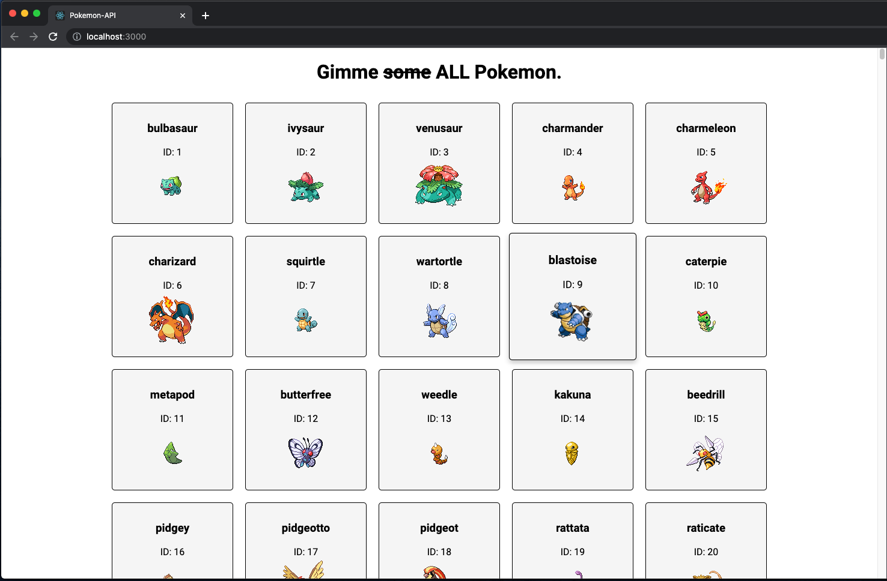

# Core Assignment "Axios-Pokemon-API"

This is Christian Johnson's work for Coding Dojo's Part-Time Accelerated MERN Stack.
It was submitted on April 26, 2023.

## Assignment description

Recreate the previous Pokemon-API assignment with Axios requests replacing the fetch requests.

## Additional Embeleshments

Carried over the embelishments from the practice assignment. In fact, this is basically the practice assignment in which I swapped out the `fetch()` requests with `axios.get()` and replaced the response objects with the `.data` property. To be clear, the idea to nest the api calls was not mine but was suggested by a benevolent robot overlord.

